# Fluxos do sistema

Este documento reúne todos os diagramas do cliente de mensageria, organizados pelo **tipo de diagrama**. Eles descrevem o comportamento **atual** do aplicativo e acompanham os requisitos do [PRD](PRD.md) (RF-xx).

## Índice

1. [Diagramas de atividade](#1-diagramas-de-atividade): o passo a passo de cada ação do usuário.
2. [Diagramas de estados](#2-diagramas-de-estados): como as partes do sistema mudam de estado.
3. [Diagramas de sequência](#3-diagramas-de-sequência): quem conversa com quem, e em que ordem.
4. [Diagrama de componentes](#4-diagrama-de-componentes): as camadas da aplicação.
5. [Pontos de atenção](#5-pontos-de-atenção): comportamentos atuais que merecem registro.

## Legenda dos participantes

| Nome | O que é |
| ---- | ------- |
| Flutter | Interface e estado do aplicativo (Dart) |
| Rust | Biblioteca nativa com o Matrix Rust SDK, ligada ao Flutter pelo Flutter Rust Bridge |
| Homeserver | Servidor Matrix (por exemplo, o Synapse local do Docker) |
| Cofre do sistema | Armazenamento seguro do sistema operacional (Keychain, libsecret ou Credential Manager) |

---

## 1. Diagramas de atividade

### 1.1. Navegação entre telas

Requisitos: RF-01, RF-04, RF-05, RF-06.

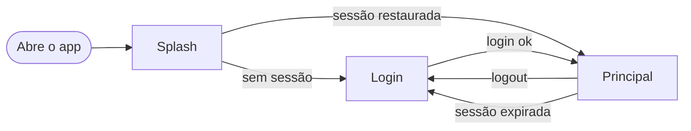

### 1.2. Inicialização e restauração da sessão

Requisitos: RF-04, RF-05.

A restauração acontece no Rust, sem esperar a resposta de uma validação separada. Um token que o servidor deixou de aceitar também pode ser descoberto depois, já na tela principal (veja 1.5).


### 1.3. Login

Requisitos: RF-01, RF-02, RF-03, RF-20, RF-21.


Regras da URL: o endereço precisa ser `https`, exceto para `localhost`, `127.0.0.1` e `::1`, onde `http` é aceito (desenvolvimento). Sem esquema, o app completa (`https`, ou `http` para localhost). A senha começa oculta e o ícone de olho no campo a mostra ou oculta (diagrama 2.7); ela nunca é guardada: ao enviar, o campo é limpo e volta a ficar oculto. Com a caixa "Salvar servidor" marcada, o servidor é lembrado; desmarcada, o servidor salvo é esquecido.

### 1.4. Logout

Requisito: RF-06.

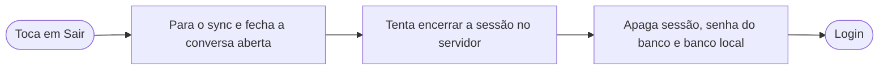

Se o servidor não responder no passo 2, o logout continua e os dados locais são apagados mesmo assim.

### 1.5. Sessão expirada durante o uso

Requisito: RF-05.

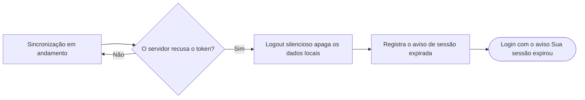

### 1.6. Layout da tela principal

Requisitos: RF-06, RF-10, RF-24, RF-25.

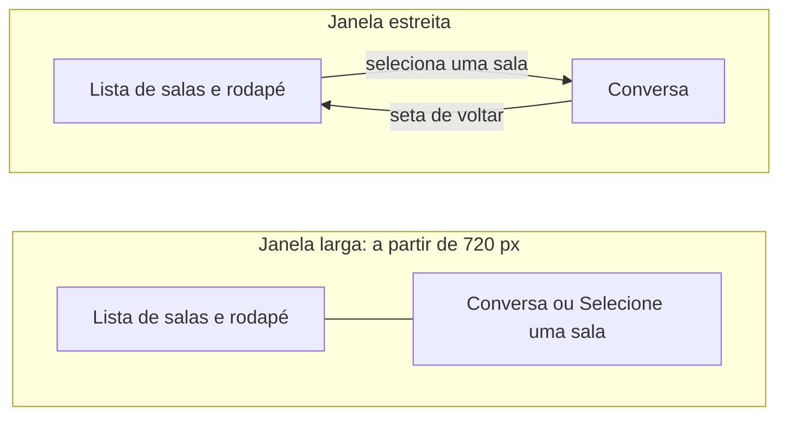

Composição das partes:

- **Aviso de conexão:** faixa fixa no topo, acima da lista e da conversa, em qualquer largura. Mostra "Sem conexão. Tentando reconectar..." quando offline, e "Não foi possível sincronizar." com o botão **Tentar de novo** quando a sincronização falha.
- **Lista de salas:** cabeçalho "Conversas" com o botão **Nova conversa**; seção **Convites** (quando houver); salas ordenadas por atividade, cada uma com avatar (inicial), nome, última mensagem, horário e indicador de não lidas.
- **Rodapé da lista:** usuário logado (avatar, nome e identificador) e o botão **Sair**. Em janela estreita, só aparece na tela da lista.
- **Conversa:** cabeçalho (com a seta de voltar em janela estreita), mensagens e campo de envio.

### 1.7. Enviar mensagem

Requisitos: RF-13, RF-14, RF-15.

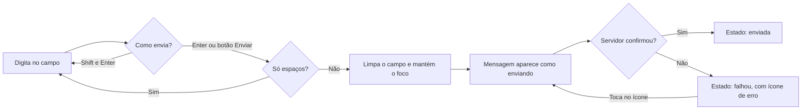

O botão de enviar fica desabilitado enquanto o campo está vazio ou só tem espaços. Shift+Enter não envia: serve para quebrar a linha.

### 1.8. Carregar o histórico

Requisito: RF-17.


A posição de leitura não pula: as mensagens antigas entram acima do que o usuário está vendo. Uma sala sem nenhuma mensagem não dispara carregamento.

### 1.9. Nova conversa

Requisito: RF-26.

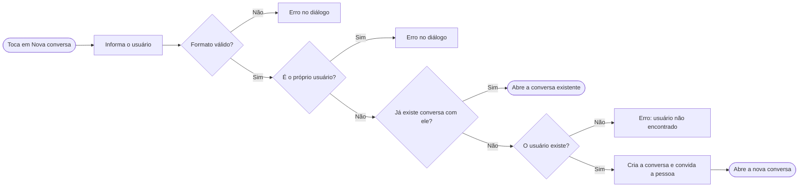

O identificador aceita `@bob:localhost`, `bob:localhost`, `@bob` ou só `bob` (o app completa com o servidor do usuário logado). A conversa criada é direta (1:1) e **não é criptografada**. O servidor aceita convidar usuários que não existem e deixaria uma sala órfã, por isso o app consulta o perfil antes de criar.

### 1.10. Convites

Requisito: RF-27.

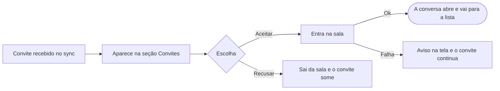

---

## 2. Diagramas de estados

### 2.1. Sessão do app

Requisitos: RF-03 a RF-06.

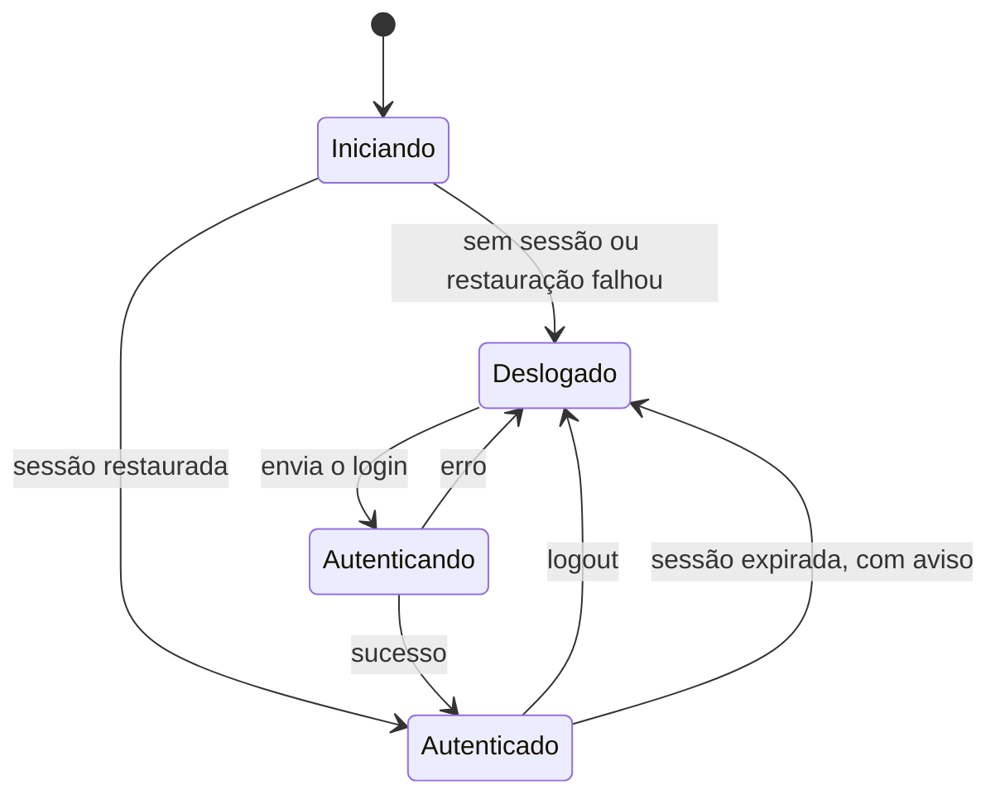

### 2.2. Sincronização

Requisitos: RF-09, RF-19.

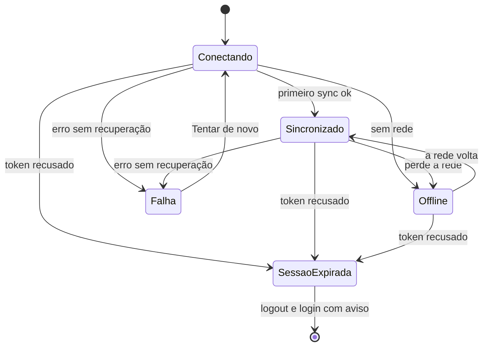

No estado **Offline**, o SDK tenta reconectar sozinho. Para distinguir "sem rede" de "token recusado", o Rust consulta o servidor (`whoami`) ao entrar em Offline. Em **Offline**, o aviso "Sem conexão. Tentando reconectar..." aparece no topo da tela principal. Em **Falha**, o aviso mostra "Não foi possível sincronizar." com o botão **Tentar de novo**, que reinicia a sincronização (volta a Conectando).

### 2.3. Conversa aberta

Requisitos: RF-10, RF-18, RF-25.

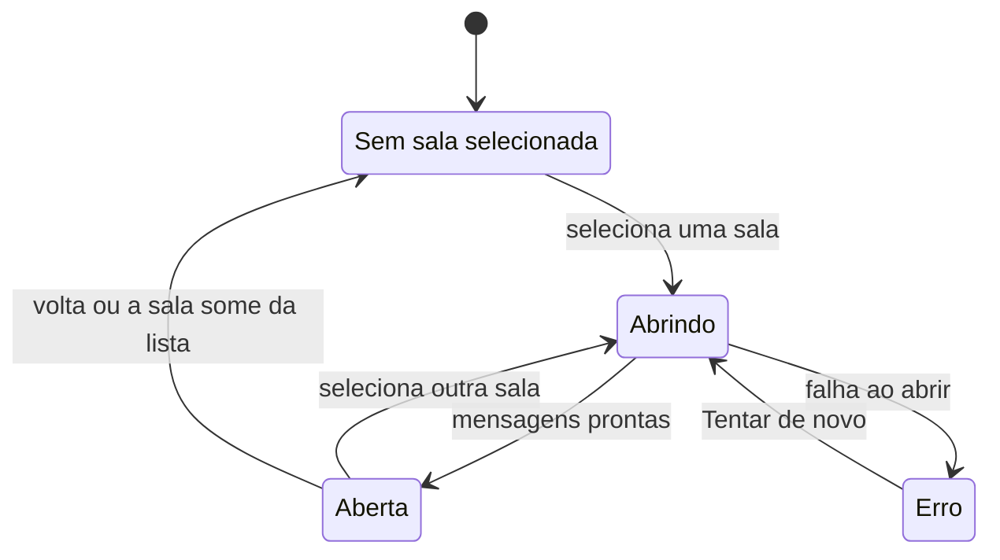

### 2.4. Mensagem enviada

Requisitos: RF-14, RF-15.

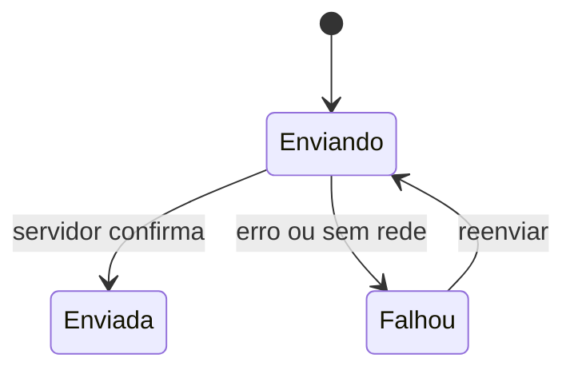

### 2.5. Histórico da conversa

Requisito: RF-17.

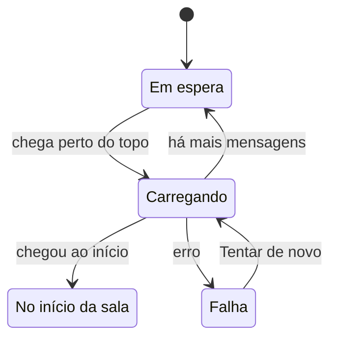

### 2.6. Convite

Requisito: RF-27.

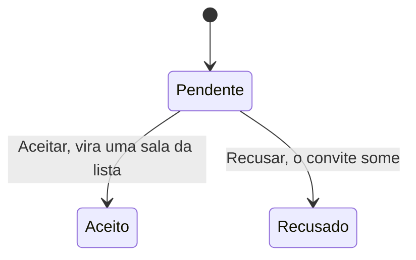

### 2.7. Campo de senha do login

Requisito: RF-01.

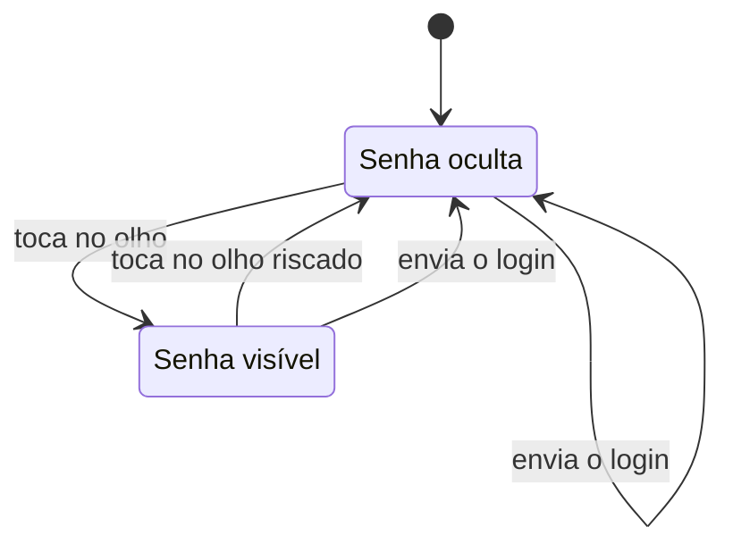

O texto digitado não se perde ao alternar. Ao enviar o login, o campo é limpo e volta a ficar oculto, para que a senha nunca permaneça à mostra depois de enviada.

---

## 3. Diagramas de sequência

### 3.1. Login

Requisitos: RF-01 a RF-03.

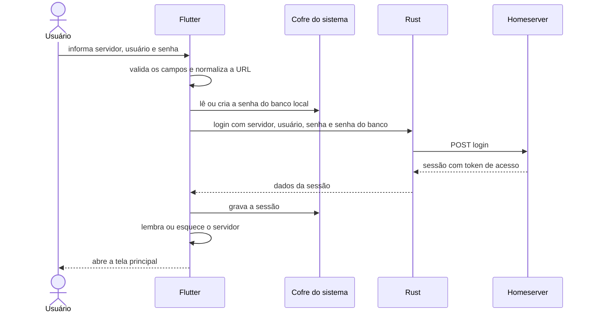

### 3.2. Abrir uma sala e ver as mensagens

Requisitos: RF-10, RF-12, RF-16.

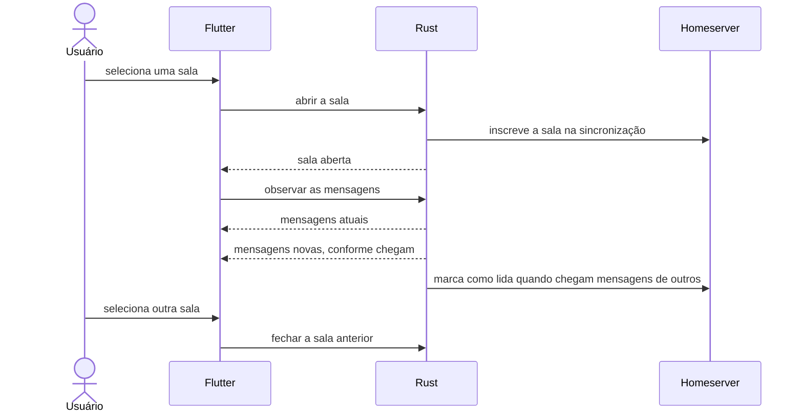

### 3.3. Enviar e reenviar uma mensagem

Requisitos: RF-13, RF-14, RF-15.

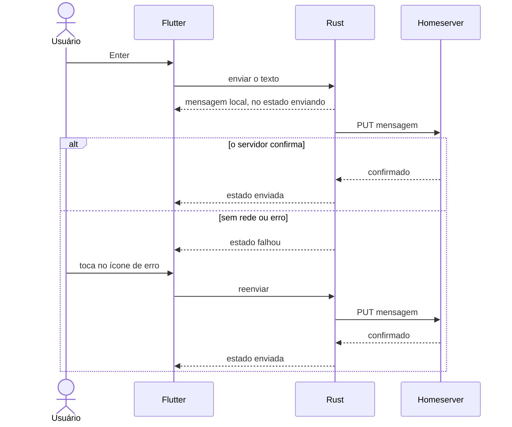

### 3.4. Atualização em tempo real

Requisitos: RF-09, RF-16, RF-19.

```mermaid
sequenceDiagram
    participant H as Homeserver
    participant R as Rust
    participant UI as Flutter
    H-->>R: sync com novos eventos
    R-->>UI: salas com última mensagem e não lidas
    R-->>UI: convites
    R-->>UI: mensagens da sala aberta
    R-->>UI: status da conexão
    UI->>UI: atualiza a lista, a conversa e o aviso de offline
```

### 3.5. Carregar o histórico

Requisito: RF-17.

```mermaid
sequenceDiagram
    actor U as Usuário
    participant UI as Flutter
    participant R as Rust
    participant H as Homeserver
    U->>UI: rola até o topo
    UI->>R: carregar 30 mensagens antigas
    R->>H: GET mensagens anteriores
    H-->>R: mensagens e marcador de início
    R-->>UI: mensagens antigas, pelo fluxo da conversa
    R-->>UI: resposta: chegou ao início ou não
    UI-->>U: indicador, mensagens ou Início da conversa
```

### 3.6. Nova conversa e convite

Requisitos: RF-26, RF-27.

```mermaid
sequenceDiagram
    actor A as Alice
    participant PA as App da Alice
    participant H as Homeserver
    participant PB as App do Bob
    actor B as Bob
    A->>PA: informa bob em Nova conversa
    PA->>PA: normaliza para @bob:localhost
    PA->>H: GET perfil de @bob
    H-->>PA: o perfil existe
    PA->>H: POST criar sala direta e convidar o Bob
    H-->>PA: identificador da sala
    PA-->>A: abre a conversa
    H-->>PB: sync traz o convite
    PB-->>B: seção Convites
    B->>PB: Aceitar
    PB->>H: POST entrar na sala
    PB-->>B: a conversa abre
```

### 3.7. Sessão expirada

Requisito: RF-05.

```mermaid
sequenceDiagram
    participant UI as Flutter
    participant R as Rust
    participant H as Homeserver
    R->>H: sync
    H-->>R: erro de token desconhecido
    R-->>UI: status sessão expirada
    UI->>R: logout
    UI->>UI: apaga os dados locais e registra o aviso
    UI-->>UI: volta ao login com Sua sessão expirou
```

---

## 4. Diagrama de componentes

### 4.1. Camadas da aplicação

Cada camada só conhece a de baixo. Todo acesso ao Matrix acontece no Rust, e o Dart nunca fala HTTP com o servidor.

```mermaid
flowchart LR
    subgraph App["Aplicativo desktop"]
        direction LR
        UI["Interface Flutter"] --> ST["Estado com Riverpod"]
        ST --> RP["Repositórios em Dart"]
        RP --> BR["Flutter Rust Bridge"]
        BR --> RU["Rust com Matrix Rust SDK"]
    end
    RU <-->|HTTPS| HS[("Homeserver Matrix")]
    RP --> CF["Cofre do sistema e preferências"]
```

| Camada | Responsabilidade |
| ------ | ---------------- |
| Interface | Telas e widgets; só falam com o estado |
| Estado | Providers e notifiers do Riverpod; modelam carregando, vazio, erro e dados |
| Repositórios | Única camada que conhece os tipos da ponte; converte para modelos de domínio |
| Ponte | Código gerado pelo Flutter Rust Bridge |
| Rust | Login, sessão, sincronização, salas, conversa, envio, histórico, criação de conversa e convites |
| Cofre e preferências | Sessão e senha do banco no cofre do sistema; servidor salvo em `shared_preferences` |

---

## 5. Pontos de atenção

Comportamentos atuais que os diagramas refletem e que vale conhecer:

1. **Restauração com falha que não é token inválido.** O app volta ao login, mas **mantém** os dados salvos e **não** mostra aviso. Só o token inválido apaga os dados. O aviso "Sua sessão expirou" aparece apenas quando o token é recusado durante o uso (1.5).
2. **Sala recém-criada.** Depois de criar uma conversa, ela é selecionada na hora, mas só aparece na lista quando a sincronização a traz. Até lá, o painel mostra "Selecione uma sala".
3. **Conversas criptografadas.** O app não as decifra: a mensagem aparece como "Mensagem criptografada". As conversas criadas pelo app não são criptografadas.
