# Fluxos do sistema

Diagramas do cliente, organizados pelo tipo de diagrama, com o comportamento atual e ligados aos requisitos do [PRD](PRD.md). Só entram os fluxos que mostram algo não óbvio (decisões, ramos de erro, comportamento assíncrono ou mais de um ator); o resto está descrito nos requisitos.

## Legenda dos participantes

| Nome | O que é |
| ---- | ------- |
| Flutter | Interface e estado do aplicativo (Dart) |
| Rust | Biblioteca nativa com o Matrix Rust SDK, ligada ao Flutter pelo Flutter Rust Bridge |
| Homeserver | Servidor Matrix (por exemplo, o Synapse local do Docker) |
| Cofre do sistema | Armazenamento seguro do sistema operacional (Keychain, libsecret ou Credential Manager) |

---

## 1. Diagramas de atividade

### 1.1. Inicialização e restauração da sessão

Requisitos: [RF-04](PRD.md#rf-04), [RF-05](PRD.md#rf-05).

A restauração é local, sem validar o token no servidor. Um token recusado só aparece depois, já na tela principal (veja 1.3).

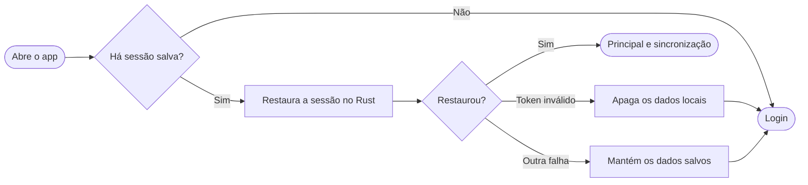

### 1.2. Login

Requisitos: [RF-01](PRD.md#rf-01), [RF-02](PRD.md#rf-02), [RF-03](PRD.md#rf-03), [RF-20](PRD.md#rf-20), [RF-21](PRD.md#rf-21).

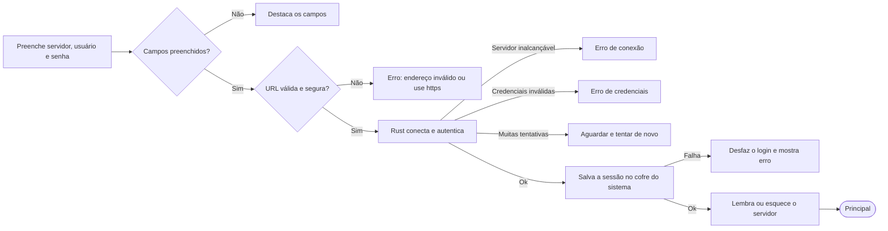

O endereço precisa ser `https`, exceto para `localhost`. Sem esquema, o app completa.

### 1.3. Sessão expirada durante o uso

Requisito: [RF-05](PRD.md#rf-05).

### 1.4. Enviar mensagem

Requisitos: [RF-13](PRD.md#rf-13), [RF-14](PRD.md#rf-14), [RF-15](PRD.md#rf-15).

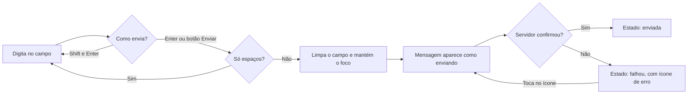

### 1.5. Carregar o histórico

Requisito: [RF-17](PRD.md#rf-17).

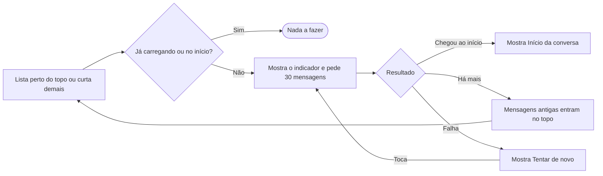

A posição de leitura não pula: as mensagens antigas entram acima do que o usuário está vendo.

### 1.6. Nova conversa

Requisito: [RF-26](PRD.md#rf-26).

O app consulta o perfil antes de criar, porque o servidor aceita convidar usuários que não existem e deixaria uma sala órfã.

### 1.7. Backup e recuperação das mensagens

Requisito: [RF-33](PRD.md#rf-33).

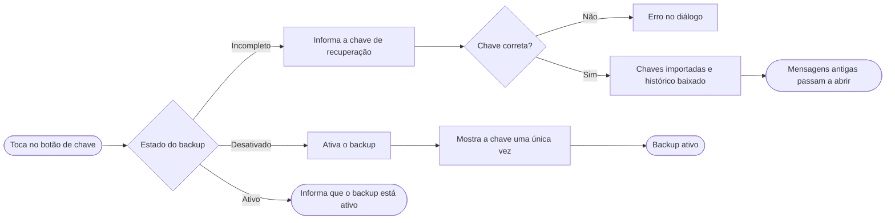

"Incompleto" quer dizer que a conta já tem backup, mas este dispositivo ainda não tem as chaves. "Desativado" quer dizer que a conta não tem backup.

---

## 2. Diagrama de estados

### 2.1. Sincronização

Requisitos: [RF-09](PRD.md#rf-09), [RF-19](PRD.md#rf-19).

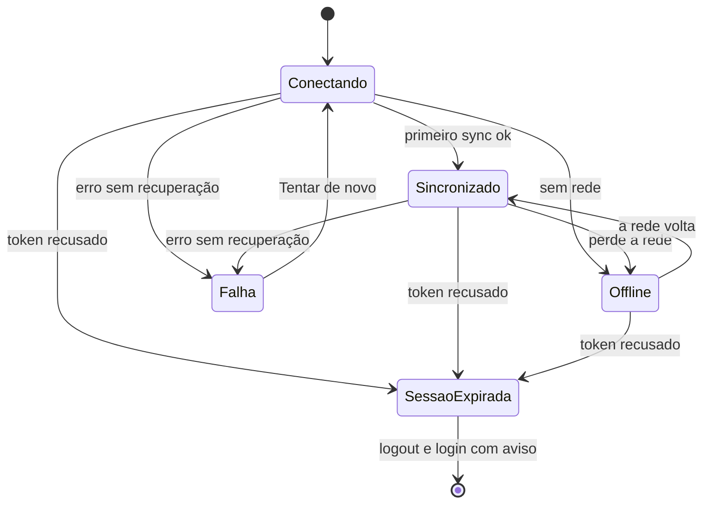

No estado Offline, o SDK tenta reconectar sozinho. Para distinguir "sem rede" de "token recusado", o Rust consulta o servidor (`whoami`) ao entrar em Offline.

---

## 3. Diagramas de sequência

### 3.1. Login

Requisitos: [RF-01](PRD.md#rf-01) a [RF-03](PRD.md#rf-03).

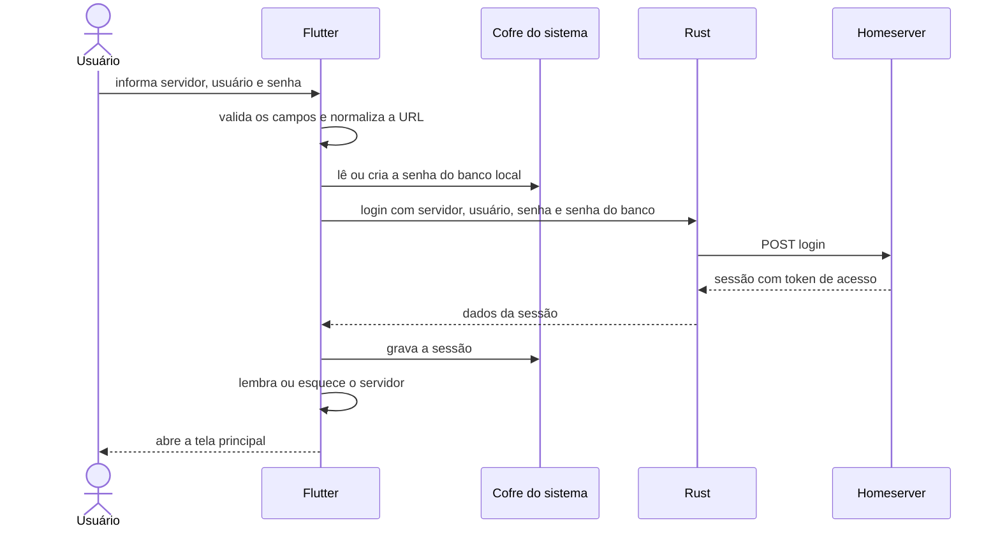

### 3.2. Abrir uma sala e receber mensagens em tempo real

Requisitos: [RF-09](PRD.md#rf-09), [RF-10](PRD.md#rf-10), [RF-12](PRD.md#rf-12), [RF-16](PRD.md#rf-16), [RF-19](PRD.md#rf-19).

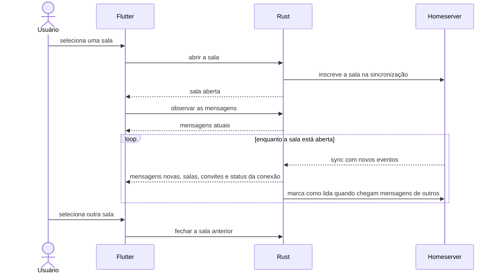

### 3.3. Enviar e reenviar uma mensagem

Requisitos: [RF-13](PRD.md#rf-13), [RF-14](PRD.md#rf-14), [RF-15](PRD.md#rf-15).

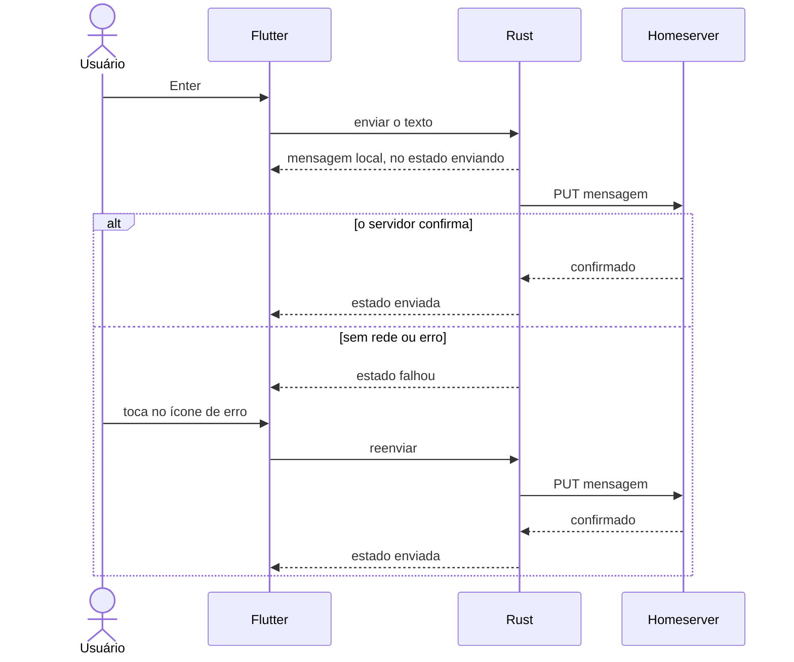

### 3.4. Nova conversa e convite

Requisitos: [RF-26](PRD.md#rf-26), [RF-27](PRD.md#rf-27).

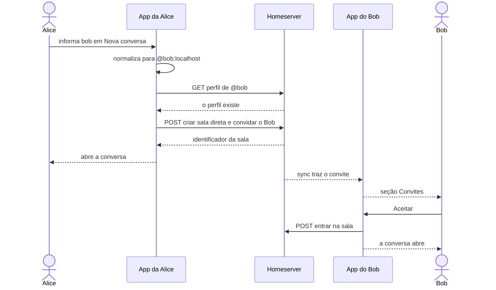

---

## 4. Diagrama de componentes

### 4.1. Camadas da aplicação

Cada camada só conhece a de baixo. Todo acesso ao Matrix acontece no Rust, e o Dart nunca fala HTTP com o servidor.

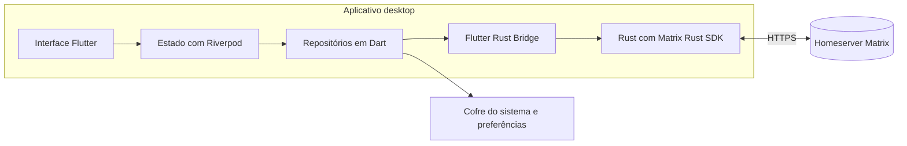

| Camada | Responsabilidade |
| ------ | ---------------- |
| Interface | Telas e widgets; só falam com o estado |
| Estado | Providers e notifiers do Riverpod; modelam carregando, vazio, erro e dados |
| Repositórios | Única camada que conhece os tipos da ponte; converte para modelos de domínio |
| Ponte | Código gerado pelo Flutter Rust Bridge |
| Rust | Login, sessão, sincronização, salas, conversa, envio, histórico, criação de conversa, convites, criptografia e recuperação de chaves |
| Cofre e preferências | Sessão e senha do banco no cofre do sistema; servidor salvo em `shared_preferences` |
