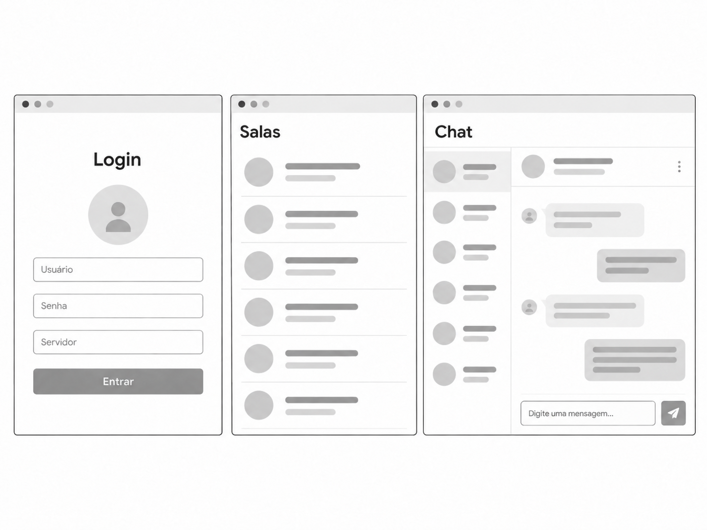
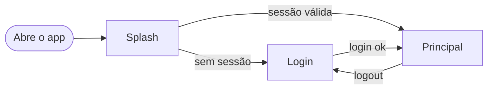
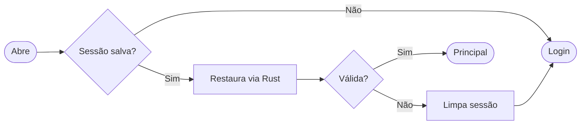
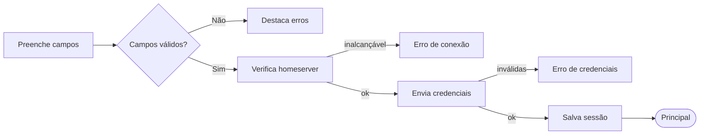
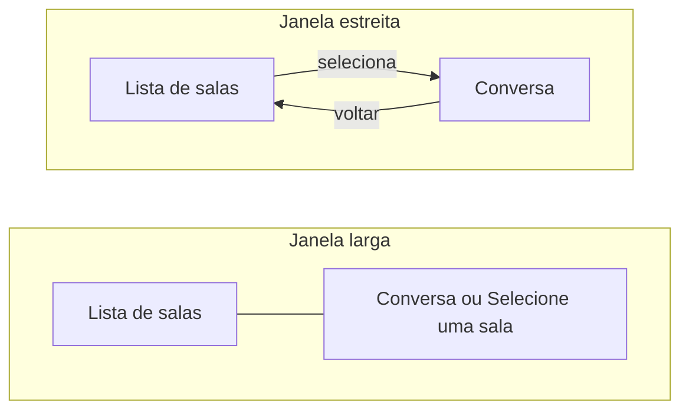
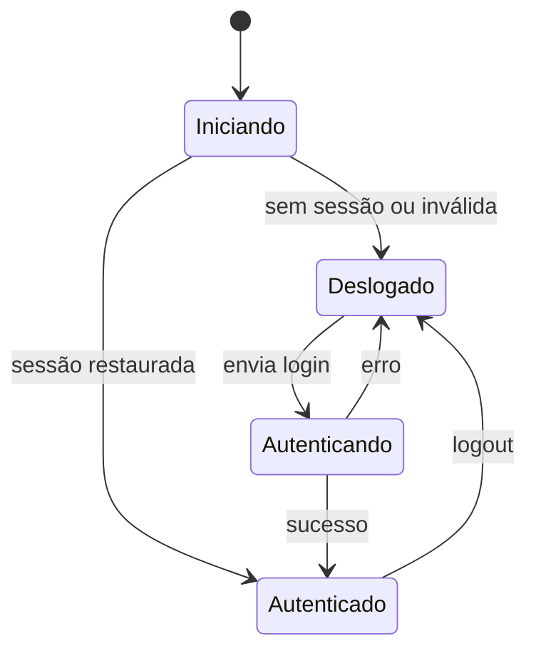
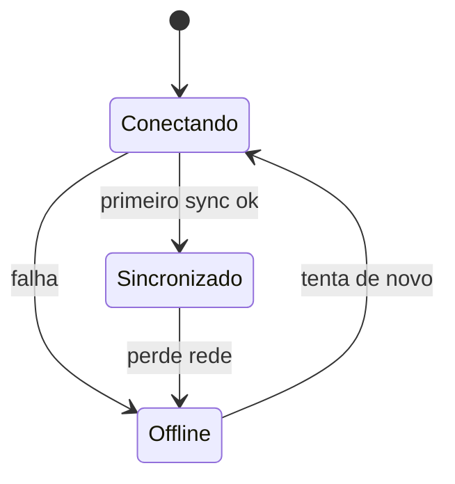
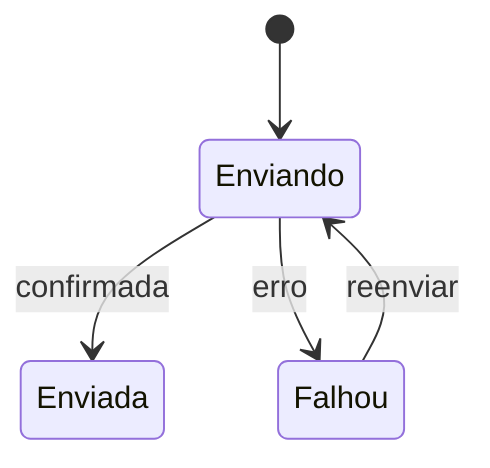
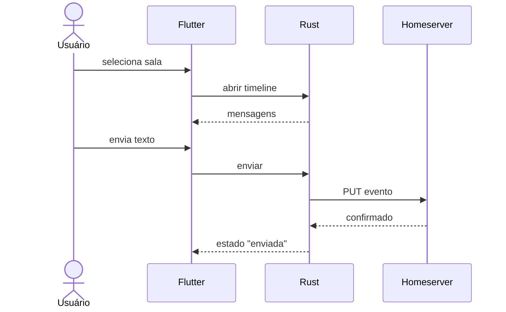
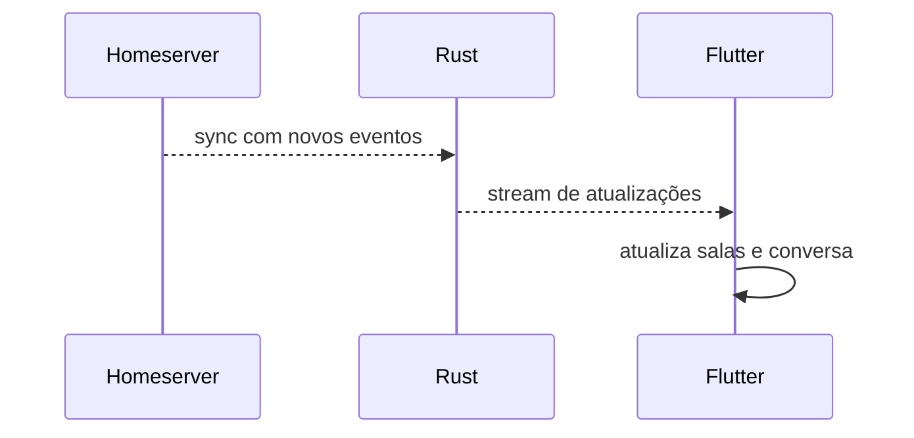

# Especificação Técnica de Requisitos (PRD)

Este documento descreve os requisitos funcionais, não funcionais, a arquitetura técnica, as decisões técnicas e as limitações do cliente de mensageria desktop com Matrix, baseado no desafio técnico (ver [desafio-tecnico.md](desafio-tecnico.md)).

> Itens marcados com `A DEFINIR` ainda dependem de decisão.

---

## 1. Pedido do Cliente

> Desenvolver uma aplicação desktop de mensageria utilizando Flutter, com foco em arquitetura, qualidade de código, segurança e experiência do usuário.
> A aplicação deverá se comunicar com um homeserver Matrix e estar preparada para execução em macOS, Windows e Linux.
> A comunicação com o Matrix deve ser implementada em Rust utilizando Matrix Rust SDK e Flutter Rust Bridge.
> Não esperamos um produto completo. O objetivo é compreender como o candidato estrutura o problema, define prioridades e prepara a solução para evoluir.

---

## 2. Stack Técnica

| Camada              | Tecnologia                               |
| ------------------- | ---------------------------------------- |
| Interface           | Flutter (desktop)                        |
| Estado              | A DEFINIR                                |
| Integração Matrix   | Rust + Matrix Rust SDK                   |
| Ponte Dart <-> Rust | Flutter Rust Bridge                      |
| Persistência local  | A DEFINIR (sessão e cache)               |
| Plataformas         | Linux, macOS, Windows                    |
| Testes              | `flutter_test`, `cargo test` (A DEFINIR) |

---

## 3. Requisitos Funcionais

### 3.1. Sessão

| ID    | Requisito                                                                                              |
| ----- | ------------------------------------------------------------------------------------------------------ |
| RF-01 | O usuário informa homeserver, usuário e senha para autenticar.                                         |
| RF-02 | O homeserver informado é validado (URL válida e servidor Matrix alcançável) antes do login.            |
| RF-03 | Após login bem-sucedido, a sessão é persistida de forma segura.                                        |
| RF-04 | Ao abrir o app, a sessão salva é restaurada automaticamente, sem pedir login de novo.                  |
| RF-05 | Se a sessão restaurada for inválida ou expirada, o app limpa a sessão e volta ao login com um aviso.   |
| RF-06 | O logout invalida a sessão no homeserver, apaga os dados locais e volta ao login. O botão Sair, com ícone de logout, fica no rodapé da lista de salas, ao lado do usuário logado. |
| RF-21 | O login oferece a opção "Salvar servidor": se marcada, o servidor informado é lembrado e já vem preenchido no próximo login. Usuário e senha nunca são salvos. |

### 3.2. Salas

| ID    | Requisito                                                                                      |
| ----- | ---------------------------------------------------------------------------------------------- |
| RF-07 | O app lista as salas em que o usuário participa, com avatar, nome e última mensagem.           |
| RF-08 | A lista é ordenada pela atividade mais recente.                                                |
| RF-09 | A lista se atualiza sozinha quando chegam novas mensagens ou salas.                            |
| RF-10 | O usuário seleciona uma sala para abrir a conversa.                                            |
| RF-11 | Salas com mensagens não lidas são destacadas na lista, com um indicador de não lidas.          |
| RF-22 | O avatar de cada sala é um círculo com a inicial do nome. O app não carrega imagens de avatar. |

### 3.3. Mensagens

| ID    | Requisito                                                                                                 |
| ----- | --------------------------------------------------------------------------------------------------------- |
| RF-12 | A conversa exibe as mensagens de texto da sala, com o horário de cada mensagem.                           |
| RF-13 | O usuário envia mensagens de texto pelo campo de envio (Enter envia, Shift+Enter quebra linha).           |
| RF-14 | A mensagem enviada aparece imediatamente com estado "enviando" e muda para "enviada" ou "falhou".         |
| RF-15 | Mensagens com falha podem ser reenviadas.                                                                 |
| RF-16 | Novas mensagens recebidas aparecem na conversa aberta sem ação do usuário.                                |
| RF-17 | Ao rolar até o topo, mensagens mais antigas são carregadas (paginação).                                   |
| RF-23 | As mensagens de outros participantes mostram o nome de quem enviou, acima da bolha.                       |

### 3.4. Estados da interface

| ID    | Requisito                                                                                          |
| ----- | -------------------------------------------------------------------------------------------------- |
| RF-18 | Telas exibem estados de carregamento, vazio e erro (ex.: "nenhuma sala", "sem conexão").           |
| RF-19 | Perda de conexão é sinalizada ao usuário e a sincronização retoma sozinha quando a rede volta.     |
| RF-20 | Erros vindos do Rust são traduzidos em mensagens claras, sem expor detalhes técnicos ou tokens.    |
| RF-24 | Em janela larga, a tela principal mostra salas e conversa lado a lado. Em janela estreita, mostra só a lista, e a conversa abre por cima dela. |
| RF-25 | Quando nenhuma sala está selecionada, o painel da conversa mostra a mensagem "Selecione uma sala". |

### 3.5. Camada Rust (exposta ao Dart)

O código Rust expõe ao Flutter, via Flutter Rust Bridge:

| Capacidade             | Descrição                                                          |
| ---------------------- | ------------------------------------------------------------------ |
| Login / logout         | Autentica e encerra a sessão no homeserver.                        |
| Restaurar sessão       | Reconstrói o cliente a partir da sessão persistida.                |
| Sync                   | Mantém a sincronização e emite eventos ao Dart por stream.         |
| Salas                  | Lista as salas e notifica mudanças.                                |
| Timeline e envio       | Carrega mensagens de uma sala, pagina o histórico e envia texto.   |

---

## 4. Requisitos Não Funcionais

- **Multiplataforma:** o projeto deve estar preparado para macOS, Windows e Linux.
- **Segurança:** credenciais e tokens não devem ser armazenados em texto puro nem aparecer em logs. Armazenamento seguro: A DEFINIR.
- **Arquitetura:** separação clara entre UI, estado, acesso ao Matrix e código Rust.
- **Tratamento de erros:** erros do Rust devem chegar ao Dart tipados e ser traduzidos em mensagens ao usuário.
- **Desempenho:** a UI não deve travar durante sync ou carregamento de histórico.
- **Manutenibilidade:** estrutura de pastas clara, facilitando a evolução do projeto.
- **Testes:** cobertura dos pontos mais relevantes (lógica de estado, camada Rust, fluxos críticos).

---

## 5. Fluxos de Interação

### Referência visual

O wireframe abaixo é a base de estrutura das telas: Login, lista de Salas e Chat (lista de salas à esquerda e conversa à direita). É uma referência de organização e fluxo, não uma especificação visual final.

Ele foi desenhado tendo o **Telegram** como inspiração: lista de conversas em uma coluna e conversa aberta ao lado, com as mensagens próprias à direita e as dos outros à esquerda.

| Tela do wireframe | Papel no app | Requisitos |
| ----------------- | ------------ | ---------- |
| Login | Servidor, usuário e senha, com a opção de salvar o servidor | RF-01 a RF-03 |
| Salas | Lista de conversas em tela cheia, usada quando a janela é estreita | RF-07 a RF-11 |
| Chat | Lista de salas à esquerda e conversa à direita, usada quando a janela é larga | RF-10, RF-12 a RF-17 |

Decisões de interface que complementam o wireframe:

- **Layout responsivo (RF-24):** janela larga mostra as duas colunas (salas e conversa); janela estreita mostra só a lista, e a conversa abre por cima dela.
- **Usuário e logout (RF-06):** o rodapé da lista de salas mostra o usuário logado (avatar com a inicial, nome e identificador completo) e o botão **Sair** com ícone de logout. Em janela larga o rodapé fica sempre visível; em janela estreita, ele aparece na tela da lista.
- **Lista de salas:** cada item mostra o avatar, o nome, a última mensagem e, quando houver, um indicador de mensagens não lidas (RF-07, RF-11).
- **Mensagens:** cada mensagem mostra o horário, e as de outros participantes mostram o nome de quem enviou acima da bolha (RF-12, RF-23). As mensagens próprias mostram o estado: enviando, enviada ou falhou (RF-14).
- **Nenhuma sala selecionada:** o painel da conversa mostra a mensagem "Selecione uma sala" (RF-25).
- **Avatares só com letras (RF-22):** não são carregadas imagens. O avatar é um círculo com a inicial do nome (por exemplo, "Alice" aparece como "A").
- **Estados de carregamento, vazio e offline** seguem o RF-18 e o RF-19.

### 5.1. Navegação entre telas

### 5.2. Inicialização e restauração de sessão

### 5.3. Tela de login

### 5.4. Layout da tela principal

O rodapé com o usuário e o botão Sair fica na base da lista de salas. A conversa é composta por cabeçalho, timeline e campo de envio; em janela estreita, o cabeçalho tem a seta de voltar.

### 5.5. Estados do app (sessão)

### 5.6. Estados da sincronização

### 5.7. Estados de uma mensagem enviada

### 5.8. Abrir uma sala e enviar mensagem

### 5.9. Atualização em tempo real

---

## 6. Decisões Técnicas

Registrar aqui as principais decisões, no formato abaixo.

### DT-001 — Gerenciamento de estado: Riverpod

- **Contexto:** o app consome streams vindos do Rust (sync, salas, timeline) e precisa de estados de carregamento, vazio e erro (RF-18), além de testes de lógica de estado.
- **Decisão:** `flutter_riverpod` com `riverpod_generator` (`AsyncNotifier`/`Notifier`). Repositórios são expostos como providers.
- **Alternativas consideradas:** BLoC (mais código para fluxos baseados em stream); Provider (DI e testes mais fracos); `setState` (não escala); GetX (mistura responsabilidades).
- **Consequências:** `AsyncValue` cobre carregando/erro/dados; `autoDispose` cancela subscriptions de stream; fakes entram via `overrides` nos testes, sem pacote de DI extra. Exige `build_runner` para gerar os providers.

### DT-002 — Armazenamento seguro da sessão: flutter_secure_storage

- **Contexto:** credenciais e tokens não podem ficar em texto puro nem em logs (RNF de segurança, RF-03).
- **Decisão:** `flutter_secure_storage` guarda a sessão serializada e uma passphrase aleatória que protege o banco SQLite do Matrix SDK. No Linux usa o libsecret; no macOS, o Keychain; no Windows, o Credential Manager. Logout e sessão inválida apagam sessão e passphrase (RF-05, RF-06).
- **Alternativas consideradas:** `shared_preferences` ou arquivo JSON (texto puro, rejeitado); guardar tudo só no Rust (a restauração via Dart ficaria mais acoplada ao SDK).
- **Consequências:** o Linux depende de um serviço de segredos (libsecret) disponível na máquina. O banco só é legível com a passphrase guardada no cofre do SO.

### DT-003 — Arquitetura em camadas por feature

- **Contexto:** o PRD exige separação clara entre UI, estado, acesso ao Matrix e Rust.
- **Decisão:** cada feature em `ui / state / data / domain`. Todo acesso ao Matrix acontece no Rust; o repositório Dart é o único ponto que conhece os tipos gerados pelo FRB e os converte em modelos de domínio. Erros do Rust chegam tipados (enum) e a UI os traduz em mensagens (RF-20).
- **Alternativas consideradas:** organização por tipo de arquivo (menos coesa); chamar a bridge direto dos widgets (acopla UI ao FRB).
- **Consequências:** mais arquivos por feature, em troca de testes simples (repositório falso) e facilidade para evoluir.

### DT-004 — Qualidade estática: very_good_analysis e clippy

- **Contexto:** o desafio valoriza qualidade de código e verificação objetiva.
- **Decisão:** `very_good_analysis` no Dart (com `public_member_api_docs` desligada, pois é app e não biblioteca) e `cargo clippy --all-targets -- -D warnings` no Rust.
- **Alternativas consideradas:** `flutter_lints` (regras mais brandas).
- **Consequências:** o analyzer é mais rigoroso; código gerado (FRB, `*.g.dart`) é excluído da análise.

---

## 7. Configuração e Execução

- **Pré-requisitos:** Flutter SDK, Rust toolchain, `flutter_rust_bridge_codegen` (versões A DEFINIR).
- **Instalação, geração da bridge e execução:** A DEFINIR.
- **Homeserver para testes:** Synapse local via `docker compose up -d`, que gera a configuração, cria os usuários `alice`, `bob`, `carol` e `dave` (senha `senha123`) e seis salas de teste com mensagens, inclusive uma com 80 mensagens para testar a paginação. Detalhes no README.

---

## 8. Limitações e Itens Não Concluídos

- Não são carregadas imagens: os avatares das salas são só a inicial do nome (RF-22), e não há envio nem exibição de anexos.
- Demais itens: A DEFINIR ao longo do desenvolvimento.
